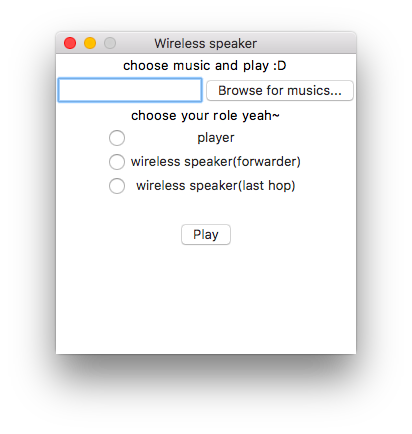

# Adhoc Audio Streaming

> Wireless Computer Network Term Project: Adhoc Audio Streaming is an audio streaming via adhoc wireless network.

# Prerequisite

จำเป็นต้องติดตั้ง Python 2.7 และ `PyAudio` และทำการ Setup Adhoc Network ก่อน (แนะนำให้ใช้ Linux เป็นคนสร้าง Network แล้วให้ Linux หรือ macOS join เข้า Network)

# How to use

มีสามบทบาทสำหรับการทำ Adhoc Audio Streaming คือ

1. **Player (client.py)**: เป็นคนเริ่มเล่น
2. **Wireless Speaker (Forwarder) (forwarder.py)**: ทำตัวเป็น speaker โดยรับ chunk แล้วส่งต่อออกไป
3. **Wireless Speaker (Last hop) (server.py)**: เป็น Speaker ตัวสุดท้าย 

โดยแรกสุดให้รัน `pyGUI.py` ขึ้นมาก่อน

```
python pyGUI.py
```

UI จะแสดงผลขึ้นมา



เลือกบทบาทที่เครื่องนั้นจะเป็น สำหรับ player ให้ทำการเลือกไฟล์เพลงก่อน โดยบังคับเป็น `.wav` เท่านั้น

ส่วน Wireless Speaker นั้นทำการกด Play แล้วก็รอฟังเพลงได้เลย :D

# Limitation

- เพลงที่เล่นจะเป็นนามสกุล wav เท่านั้น
- ต้องเซ๊ต Static IP ก่อนใช้งานในโค้ด